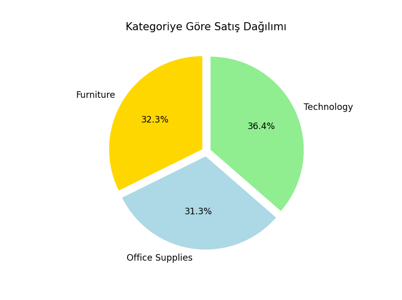
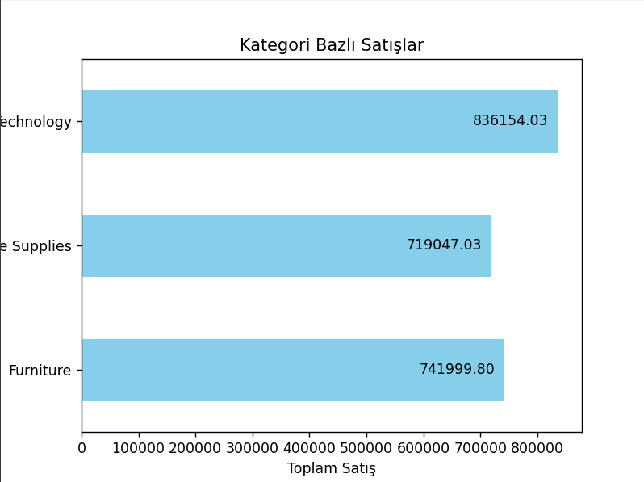
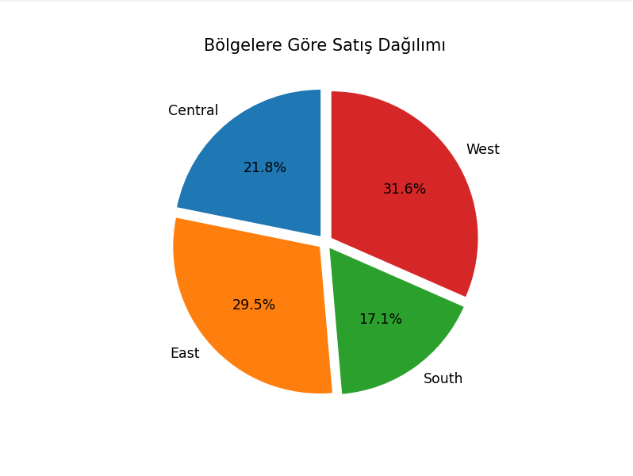
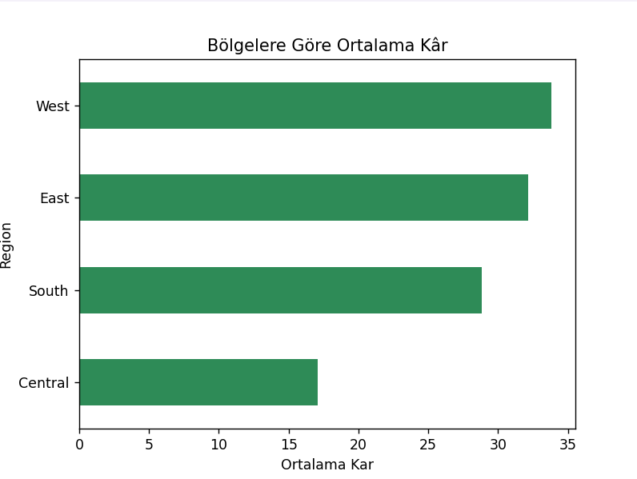
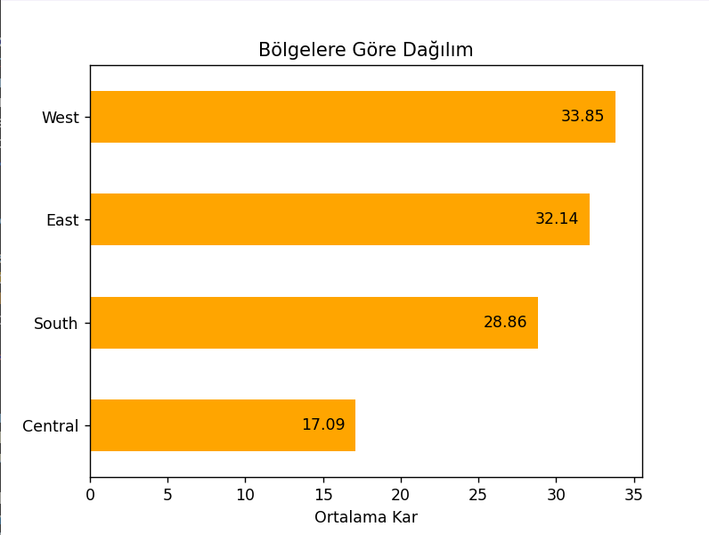
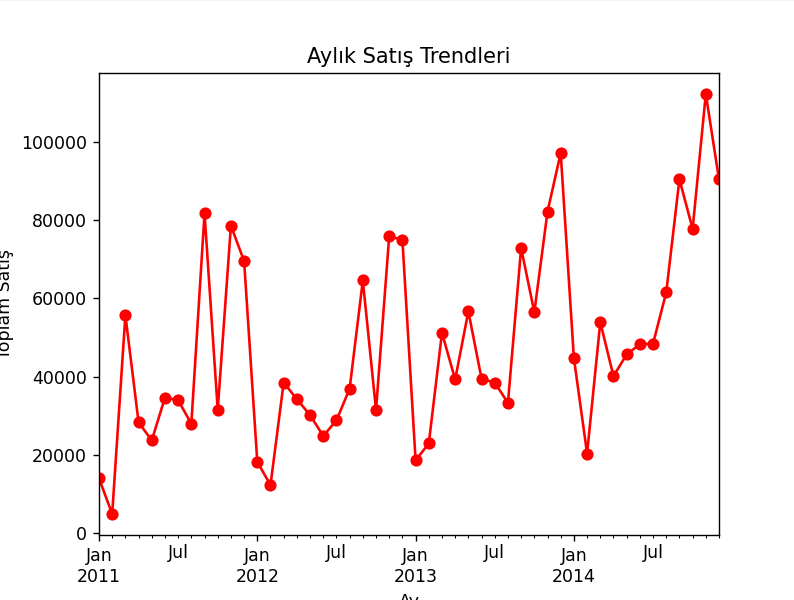

# Superstore-Sales-Analysis
📊 **Superstore Satış Analizi ve Görselleştirme**

Bu proje, Superstore veri seti üzerinde satış, kâr, indirim ve teslim süresi gibi metriklerin analizini ve görselleştirilmesini içermektedir.  
Amaç, farklı bölgeler, kategoriler ve segmentler üzerinden iş performansını anlamak ve içgörüler elde etmektir.

---

## 🚀 Kullanılan Teknolojiler
- **Python 3**
- **Pandas** → Veri işleme ve analiz
- **NumPy** → Matematiksel işlemler
- **Matplotlib** → Veri görselleştirme

---

## 🔍 Proje Adımları

### 1. Veri Setini Tanıma
- Satır ve kolon bilgileri
- Eksik değer analizi
- Veri tiplerinin incelenmesi

### 2. Veri Ön İşleme
- `Order Date` ve `Ship Date` kolonlarının **datetime** formatına dönüştürülmesi  
- **Teslim Süresi (Shipping Duration)** kolonunun eklenmesi  

### 3. Genel Analizler
- Toplam ve ortalama satış ile kâr hesaplamaları  
- Bölgelere göre satış ve kâr dağılımları  
- Kategorilere göre satış ve kâr dağılımları  
- Ortalama teslim süreleri  

### 4. Görselleştirmeler
📌 Projede farklı grafik türleri kullanılmıştır:

- **Histogram** → Teslim sürelerinin dağılımı  
- **Bar Chart** → Kategorilere göre satışlar  
- **Horizontal Bar Chart** → Bölgelere göre ortalama kâr  
- **Scatter Plot** → İndirim – Kâr ilişkisi  
- **Line Chart** → Aylık satış trendleri  
- **Pie Chart** → Kategori, segment ve bölgelere göre satış/kâr dağılımı

---

## 📈 Örnek Çıktılar

### 📌 Teslim Süresi Dağılımı (Histogram)
- Ortalama teslim süresi: ~4 gün  
- Minimum: 0 gün  
- Maksimum: 7 gün  

### 📌 Kategorilere Göre Satışlar (Bar Chart)
- En çok satış yapan kategori: **Technology**  
- Diğer alanlarda satışlar bibirine yakın değerlere sahip.  

### 📌 Bölgelere Göre Ortalama Kâr (Barh Chart)
- **Batı bölgesi** satışlarda önde.  
- west, east , south, central şeklinde bir sıralama görüyoruz.  

### 📌 Aylık Satış Trendleri (Line Chart)
- Belirli dönemlerde satışların arttığı gözlemleniyor (**sezonluk etki**).

### Kategorilere Göre Analiz
| Grafik 1 | Grafik 2 | Grafik 3 |
|----------|----------|----------|
|  |  |  |

### Bölgelere Göre Analiz
| Grafik 1 | Grafik 2 | Grafik 3 |
|----------|----------|----------|
|  |  |  |

### Segmentlere Göre Analiz

  

### En Çok Satan 10 Ürün

  

### Aylık Satış Trendleri

  

---

## ⚡ Fonksiyonlar
Projede tekrar kullanılabilirlik için bazı fonksiyonlar yazılmıştır:

- **`check_df()`** → Veri setini hızlıca tanımak için
- **`plot_bar_with_labels()`** → Değer etiketli bar grafiği oluşturmak için.
- **`plot_pie()`** → Pie chart (dilim grafiği) otomatik oluşturmak için.

## 📂 Veri Seti

Bu projede kullanılan veri seti Kaggle'dan alınmıştır:  
🔗 [Superstore Dataset (Kaggle)](https://www.kaggle.com/datasets/ishanshrivastava28/superstore-sales)

✍️ **Not:** Bu proje öğrenme amaçlı yapılmıştır ve farklı veri setleri üzerinde de kolayca uyarlanabilir.
